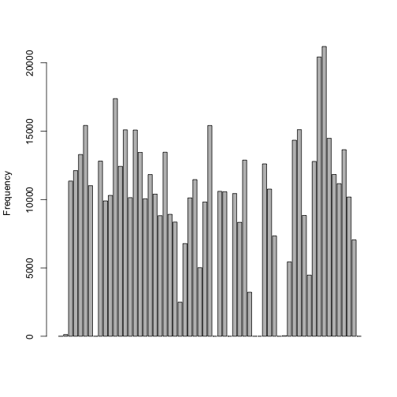

opts_chunk$set(echo=TRUE)

## Loading and preprocessing the data

```r
setwd("/Users/konggas")
activity <- read.csv("./activity.csv")
activity$datep <- strptime(activity$date,"%Y-%m-%d")
activity<-activity[order(activity$datep,activity$interval),]
```

## What is mean total number of steps taken per day?

```r
library("plyr")
act_day <- ddply(activity,~date,summarise,sum=sum(steps,na.rm=TRUE), mean=mean(steps,na.rm=TRUE), median=median(steps,na.rm=TRUE))
```
### Histogram of the total number of steps taken each day
 
### Mean and median total number of steps taken per day

```r
print(act_day)
```

```
##          date   sum    mean median
## 1  2012-10-01     0     NaN     NA
## 2  2012-10-02   126  0.4375      0
## 3  2012-10-03 11352 39.4167      0
## 4  2012-10-04 12116 42.0694      0
## 5  2012-10-05 13294 46.1597      0
## 6  2012-10-06 15420 53.5417      0
## 7  2012-10-07 11015 38.2465      0
## 8  2012-10-08     0     NaN     NA
## 9  2012-10-09 12811 44.4826      0
## 10 2012-10-10  9900 34.3750      0
## 11 2012-10-11 10304 35.7778      0
## 12 2012-10-12 17382 60.3542      0
## 13 2012-10-13 12426 43.1458      0
## 14 2012-10-14 15098 52.4236      0
## 15 2012-10-15 10139 35.2049      0
## 16 2012-10-16 15084 52.3750      0
## 17 2012-10-17 13452 46.7083      0
## 18 2012-10-18 10056 34.9167      0
## 19 2012-10-19 11829 41.0729      0
## 20 2012-10-20 10395 36.0938      0
## 21 2012-10-21  8821 30.6285      0
## 22 2012-10-22 13460 46.7361      0
## 23 2012-10-23  8918 30.9653      0
## 24 2012-10-24  8355 29.0104      0
## 25 2012-10-25  2492  8.6528      0
## 26 2012-10-26  6778 23.5347      0
## 27 2012-10-27 10119 35.1354      0
## 28 2012-10-28 11458 39.7847      0
## 29 2012-10-29  5018 17.4236      0
## 30 2012-10-30  9819 34.0938      0
## 31 2012-10-31 15414 53.5208      0
## 32 2012-11-01     0     NaN     NA
## 33 2012-11-02 10600 36.8056      0
## 34 2012-11-03 10571 36.7049      0
## 35 2012-11-04     0     NaN     NA
## 36 2012-11-05 10439 36.2465      0
## 37 2012-11-06  8334 28.9375      0
## 38 2012-11-07 12883 44.7326      0
## 39 2012-11-08  3219 11.1771      0
## 40 2012-11-09     0     NaN     NA
## 41 2012-11-10     0     NaN     NA
## 42 2012-11-11 12608 43.7778      0
## 43 2012-11-12 10765 37.3785      0
## 44 2012-11-13  7336 25.4722      0
## 45 2012-11-14     0     NaN     NA
## 46 2012-11-15    41  0.1424      0
## 47 2012-11-16  5441 18.8924      0
## 48 2012-11-17 14339 49.7882      0
## 49 2012-11-18 15110 52.4653      0
## 50 2012-11-19  8841 30.6979      0
## 51 2012-11-20  4472 15.5278      0
## 52 2012-11-21 12787 44.3993      0
## 53 2012-11-22 20427 70.9271      0
## 54 2012-11-23 21194 73.5903      0
## 55 2012-11-24 14478 50.2708      0
## 56 2012-11-25 11834 41.0903      0
## 57 2012-11-26 11162 38.7569      0
## 58 2012-11-27 13646 47.3819      0
## 59 2012-11-28 10183 35.3576      0
## 60 2012-11-29  7047 24.4688      0
## 61 2012-11-30     0     NaN     NA
```


## What is the average daily activity pattern?

```r
act_int <- ddply(activity,~interval,summarise,mean=mean(steps,na.rm=TRUE))
act_ts <- ts(act_int$mean)
```
### Time series plot of the 5-minute interval and the average number of steps taken, averaged across all days
 
### Interval 835 (row=104) has the maximum average steps taken.

```r
act_int[which.max(act_int$mean),]
```

```
##     interval  mean
## 104      835 206.2
```


## Imputing missing values

### Ttal number of missing values in the dataset 

```r
sum(is.na(activity$steps))
```

```
## [1] 2304
```

### Strategy for filling in all of the missing values in the dataset is  using either left or right non-missing value

### New dataset that is equal to the original dataset but with the missing data filled in: act_imp

```r
fillin <- function(x) {
  for (i in 2:nrow(x)) {
    if (is.na(x[i,1]) == TRUE) {
      x[i,1] <- x[i-1,1]
    }
  }
  for (i in (nrow(x)-1):1) {
    if (is.na(x[i,1]) == TRUE) {
      x[i,1] <- x[i+1,1]
    }
  }
  x
}
act_imp<-fillin(activity)
```

### Histogram of the total number of steps taken each day and Calculate
 

### Mean and median total number of steps taken per day

```r
act_day2 <- ddply(act_imp,~date,summarise,sum = sum(steps), mean=mean(steps,na.rm=TRUE),median=median(steps,na.rm=TRUE))

print(act_day2)
```

```
##          date   sum    mean median
## 1  2012-10-01     0  0.0000      0
## 2  2012-10-02   126  0.4375      0
## 3  2012-10-03 11352 39.4167      0
## 4  2012-10-04 12116 42.0694      0
## 5  2012-10-05 13294 46.1597      0
## 6  2012-10-06 15420 53.5417      0
## 7  2012-10-07 11015 38.2465      0
## 8  2012-10-08     0  0.0000      0
## 9  2012-10-09 12811 44.4826      0
## 10 2012-10-10  9900 34.3750      0
## 11 2012-10-11 10304 35.7778      0
## 12 2012-10-12 17382 60.3542      0
## 13 2012-10-13 12426 43.1458      0
## 14 2012-10-14 15098 52.4236      0
## 15 2012-10-15 10139 35.2049      0
## 16 2012-10-16 15084 52.3750      0
## 17 2012-10-17 13452 46.7083      0
## 18 2012-10-18 10056 34.9167      0
## 19 2012-10-19 11829 41.0729      0
## 20 2012-10-20 10395 36.0938      0
## 21 2012-10-21  8821 30.6285      0
## 22 2012-10-22 13460 46.7361      0
## 23 2012-10-23  8918 30.9653      0
## 24 2012-10-24  8355 29.0104      0
## 25 2012-10-25  2492  8.6528      0
## 26 2012-10-26  6778 23.5347      0
## 27 2012-10-27 10119 35.1354      0
## 28 2012-10-28 11458 39.7847      0
## 29 2012-10-29  5018 17.4236      0
## 30 2012-10-30  9819 34.0938      0
## 31 2012-10-31 15414 53.5208      0
## 32 2012-11-01     0  0.0000      0
## 33 2012-11-02 10600 36.8056      0
## 34 2012-11-03 10571 36.7049      0
## 35 2012-11-04     0  0.0000      0
## 36 2012-11-05 10439 36.2465      0
## 37 2012-11-06  8334 28.9375      0
## 38 2012-11-07 12883 44.7326      0
## 39 2012-11-08  3219 11.1771      0
## 40 2012-11-09     0  0.0000      0
## 41 2012-11-10     0  0.0000      0
## 42 2012-11-11 12608 43.7778      0
## 43 2012-11-12 10765 37.3785      0
## 44 2012-11-13  7336 25.4722      0
## 45 2012-11-14     0  0.0000      0
## 46 2012-11-15    41  0.1424      0
## 47 2012-11-16  5441 18.8924      0
## 48 2012-11-17 14339 49.7882      0
## 49 2012-11-18 15110 52.4653      0
## 50 2012-11-19  8841 30.6979      0
## 51 2012-11-20  4472 15.5278      0
## 52 2012-11-21 12787 44.3993      0
## 53 2012-11-22 20427 70.9271      0
## 54 2012-11-23 21194 73.5903      0
## 55 2012-11-24 14478 50.2708      0
## 56 2012-11-25 11834 41.0903      0
## 57 2012-11-26 11162 38.7569      0
## 58 2012-11-27 13646 47.3819      0
## 59 2012-11-28 10183 35.3576      0
## 60 2012-11-29  7047 24.4688      0
## 61 2012-11-30     0  0.0000      0
```
They are the same. It happens that the means and medians of the imputed data are the same as original data since if there is "NA" value exist then the date has all "NA" values.


## Are there differences in activity patterns between weekdays and weekends?

### Create a new factor variable in the dataset with two levels -- "weekday" and "weekend" indicating whether a given date is a weekday or weekend day. And it is named as act_imp3 

```r
act_imp2 <- act_imp
act_imp2$day <- weekdays(act_imp2$datep)
act_imp2$weekday<-""
weekday <- function(x) {
  res<-data.frame()
  for (i in 1:nrow(x)) {
    if (x[i,5] == "Sunday" || x[i,5] == "Saturday") {
      x[i,6] = "weekend";
    }
    else {
      x[i,6]="weekday";      
    }
  }
  x
}
act_imp3<-weekday(act_imp2)
act_imp3$weekday <- as.factor(act_imp3$weekday)
```

### Panel plot containing a time series plot of the 5-minute interval and the average number of steps taken, averaged across all weekday days or weekend days

```r
act_week <- ddply(act_imp3,~interval+weekday,summarise,mean=mean(steps,na.rm=TRUE))

act_week1<-act_week[act_week$weekday=="weekday",c(1,3)]
act_week2<-act_week[act_week$weekday=="weekend",c(1,3)]
names(act_week1)[2]<- "weekday"
names(act_week2)[2]<- "weekend"

act_week_mer<-merge(act_week1,act_week2,by="interval")
act_week_mer<-act_week_mer[,c(2,3)]
act_ts <- ts(act_week_mer)
```
 
